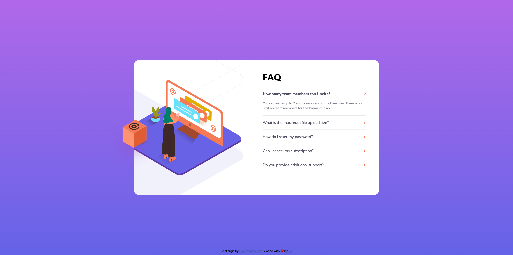

# Frontend Mentor - FAQ accordion card solution

This is a solution to the [FAQ accordion card challenge on Frontend Mentor](https://www.frontendmentor.io/challenges/faq-accordion-card-XlyjD0Oam). Frontend Mentor challenges help you improve your coding skills by building realistic projects. 

## Table of contents

- [Overview](#overview)
  - [The challenge](#the-challenge)
  - [Screenshot](#screenshot)
  - [Links](#links)
  - [Useful resources](#useful-resources)
- [Author](#author)

## Overview

### The challenge

Users should be able to:

- View the optimal layout for the component depending on their device's screen size
- See hover states for all interactive elements on the page
- Hide/Show the answer to a question when the question is clicked

### Useful resources

- [10 Methods for Vertical Alignment Using CSS](https://refine.dev/blog/css-vertical-align/#vertical-alignment-using-margins)
- [How to build a pure CSS accordion](https://dev.to/cchana/how-to-build-a-pure-css-accordion-5gcg)
- [CSS Only Accordion](https://dev.to/sababg/css-only-accordion-59db)
- [CodePen Home - Pure CSS Accordion](https://codepen.io/raubaca/pen/PZzpVe)
- [MDN - Subsequent-sibling combinator](https://developer.mozilla.org/en-US/docs/Web/CSS/Subsequent-sibling_combinator)
- [CSS background-position Property](https://www.w3schools.com/cssref/pr_background-position.php)

### Screenshot

### Links

- Solution URL: [https://github.com/mileine/frontendmentor-faq-accordion-card](https://github.com/mileine/frontendmentor-faq-accordion-card)
- Live Site URL: [https://frontendmentor-faq-accordion-card-omega.vercel.app/](https://frontendmentor-faq-accordion-card-omega.vercel.app/)

## Author

- Frontend Mentor - [https://www.frontendmentor.io/profile/mileine](https://www.frontendmentor.io/profile/mileine)

